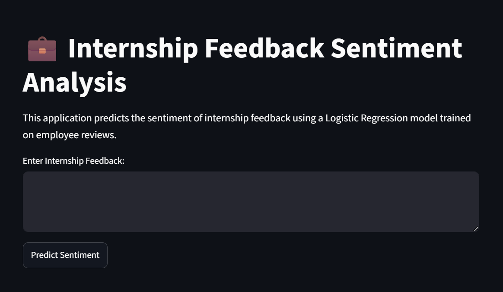
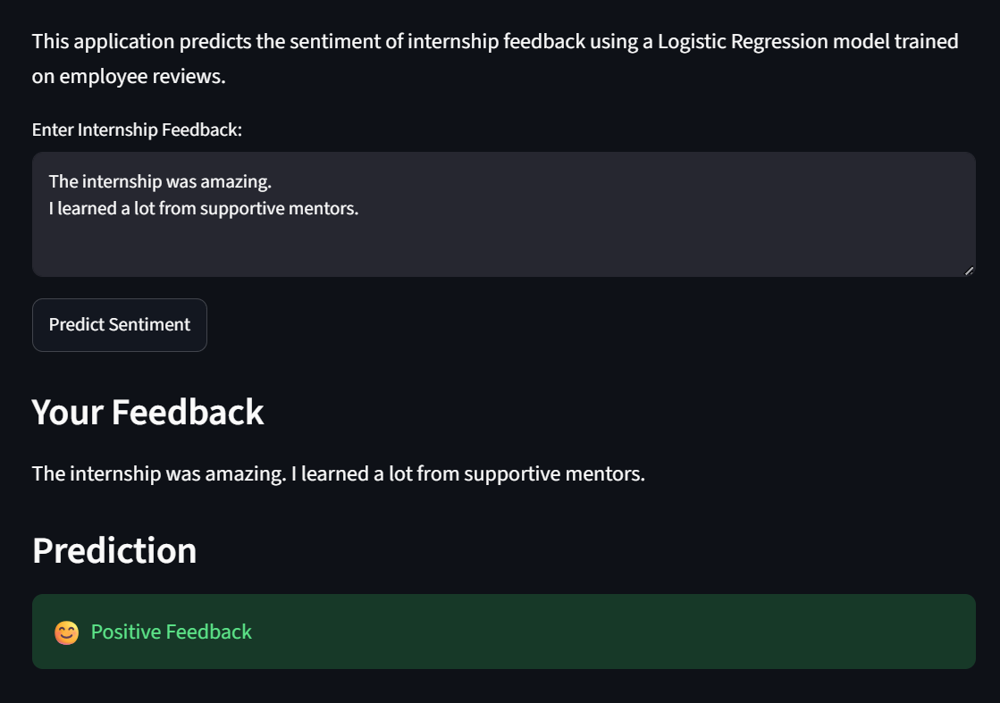
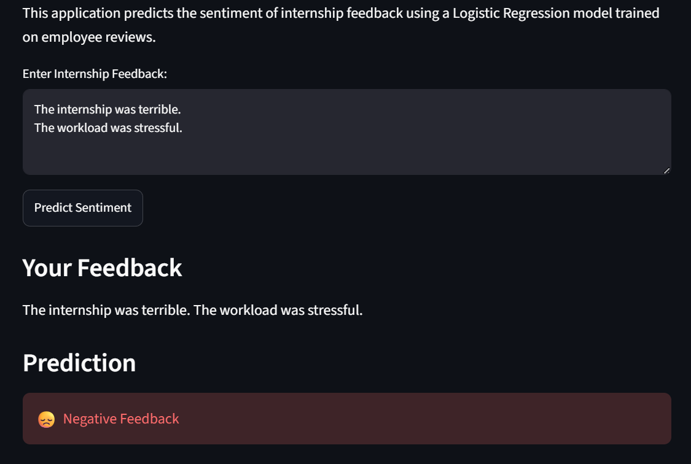

# 💼 Sentiment Analysis of Internship Feedback


An end-to-end **Machine Learning** and **Natural Language Processing (NLP)** project that analyzes internship feedback using **Logistic Regression** and **TF-IDF Vectorization**. The project includes an interactive **Streamlit** web application for real-time sentiment prediction.

## 📑 Table of Contents

- [🚀 Live Demo](#-live-demo)
- [📸 Application Preview](#-application-preview)
- [📖 Project Overview](#-project-overview)
- [🎯 Problem Statement](#-problem-statement)
- [📂 Dataset](#-dataset)
- [✨ Key Features](#-key-features)
- [🛠️ Technologies Used](#-technologies-used)
- [🧠 Machine Learning Workflow](#-machine-learning-workflow)
- [📊 Model Performance](#-model-performance)
- [📁 Project Structure](#-project-structure)
- [⚙️ Installation](#-installation)
- [🔮 Future Improvements](#-future-improvements)
- [👩‍💻 About the Author](#-about-the-author)

## Live Demo

🌐 **Streamlit App:** https://sentiment-analysis-internship-feedback-jdufyxzlpjvyx5nka6hwx9.streamlit.app/

📂 **GitHub Repository:** https://github.com/areeshabatool1416/Sentiment-Analysis-Internship-Feedback

## Application Preview

### Home Screen



### Positive Prediction



### Negative Prediction



##  Project Overview

Understanding intern feedback is essential for improving internship programs and enhancing the overall learning experience.

This project uses Machine Learning and Natural Language Processing (NLP) techniques to analyze textual internship feedback and predict its sentiment. Reviews are cleaned, transformed into numerical features using TF-IDF Vectorization, and classified with a Logistic Regression model. The final model is deployed through an interactive Streamlit web application for real-time predictions.

##  Problem Statement

Organizations receive large amounts of textual feedback from interns. Manually reviewing every response is time-consuming and inconsistent.

This project automates the sentiment analysis process by classifying internship feedback, enabling organizations to quickly identify positive experiences.

## 📂 Dataset

This project uses the **Employee Reviews Dataset** to simulate internship feedback for sentiment analysis.

Since publicly available internship feedback datasets are limited, employee reviews were selected as a representative source of workplace feedback. The dataset contains **67,529 reviews** with fields such as:

- Summary
- Pros
- Cons
- Overall Rating

The textual fields were combined to create a single review for sentiment classification.

## ✨ Key Features

- End-to-end NLP pipeline for text classification.
- Text preprocessing using NLTK.
- TF-IDF Vectorization for feature extraction.
- Logistic Regression model for sentiment prediction.
- Interactive Streamlit web application.
- Real-time sentiment analysis.
- Publicly deployed application.

##  Technologies Used

- Python
- Pandas
- NumPy
- Matplotlib
- NLTK
- Scikit-learn
- TF-IDF Vectorizer
- Logistic Regression
- Joblib
- Streamlit

##  Machine Learning Workflow

Employee Reviews Dataset
        │
        ▼
Exploratory Data Analysis
(Understand the data)
        │
        ▼
Data Cleaning
(Remove irrelevant columns & handle missing values)
        │
        ▼
Text Preprocessing
(Lowercase, Tokenization, Stopword Removal, Lemmatization)
        │
        ▼
TF-IDF Vectorization
(Convert text into numerical features)
        │
        ▼
Logistic Regression
(Train the classifier)
        │
        ▼
Model Evaluation
(Accuracy & Performance Metrics)
        │
        ▼
Streamlit Deployment

## 📊 Model Performance

| Metric             | Value               |
| ------------------ | ------------------- |
| Model              | Logistic Regression |
| Feature Extraction | TF-IDF Vectorizer   |
| Accuracy           | **73.15%**          |
| Dataset Size       | **67,529 Reviews**  |


##  Project Structure

```
Sentiment-Analysis-Internship-Feedback/
│
├── app/
│   └── app.py
│
├── data/
│   └── employee_reviews.csv
│
├── images/
│   ├── home.png
│   ├── positive.png
│   └── negative.png
│
├── models/
│   ├── logistic_model.pkl
│   └── tfidf_vectorizer.pkl
│
├── notebooks/
│   └── Sentiment_Analysis.ipynb
│
├── requirements.txt
├── README.md
└── .gitignore
```

## ⚙️ Installation

Clone the repository:

```bash
git clone https://github.com/areeshabatool1416/Sentiment-Analysis-Internship-Feedback.git
```

Navigate into the project:

```bash
cd Sentiment-Analysis-Internship-Feedback
```

Install the dependencies:

```bash
pip install -r requirements.txt
```

Run the Streamlit application:

```bash
streamlit run app/app.py
```

## Future Improvements

- Improve sentiment classification performance.
- Experiment with transformer-based models such as BERT.
- Add confidence scores for predictions.
- Enhance the user interface with additional analytics.
- Support multilingual feedback analysis.

##  About the Author

**Areesha Batool**

Computer Science student with a strong interest in Artificial Intelligence, Machine Learning, and Natural Language Processing. Passionate about building end-to-end ML applications and continuously learning through real-world projects.

 Feel free to connect with me on LinkedIn!
https://www.linkedin.com/in/areesha-batool-667651262/